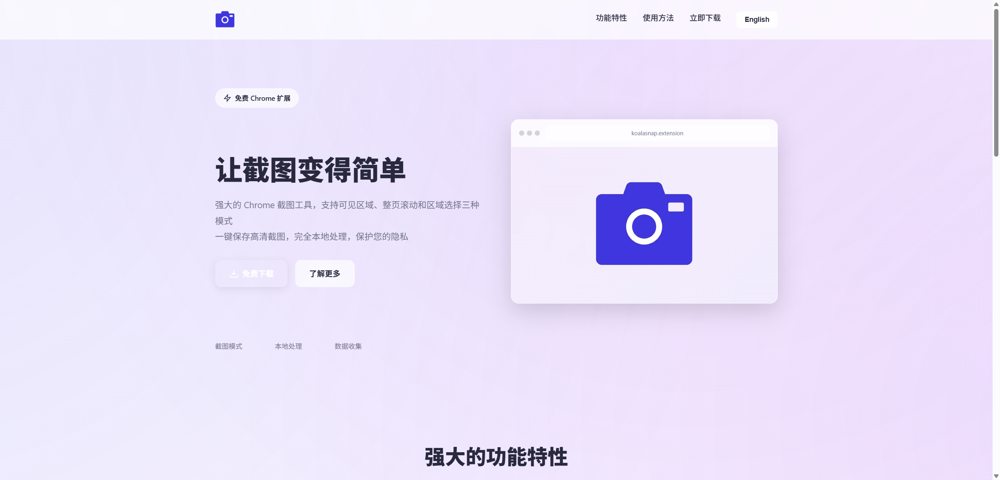
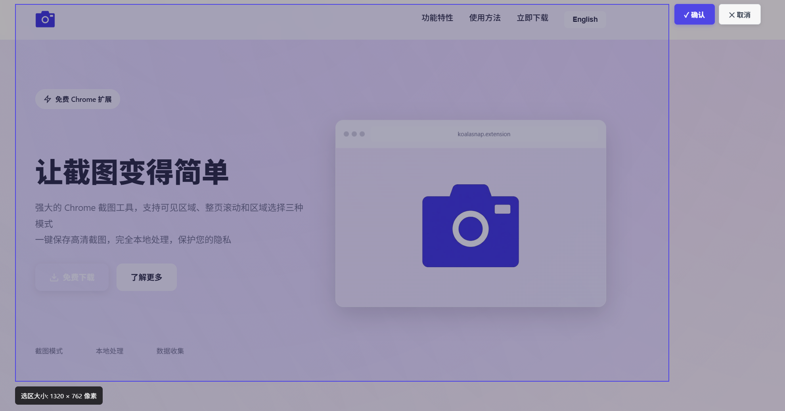

# KoalaSnap - 考拉易截

> 一款强大而简洁的 Chrome 截图扩展 | A Powerful and Simple Chrome Screenshot Extension

[](https://chrome.google.com/webstore)
[](https://github.com/Bitkoala/KoalaSnap)
[](https://github.com/Bitkoala/KoalaSnap/blob/main/LICENSE)
[](https://github.com/Bitkoala/KoalaSnap/releases)

<div align="center">


**强大的截图工具，支持三种截图模式**

*Powerful screenshot tool with three capture modes*

[](https://chrome.google.com/webstore)
[](https://developer.chrome.com/docs/extensions/mv3/)
[](LICENSE)

</div>

## 📸 功能展示

<div align="center">

### 产品落地页


### 扩展界面


### 区域选择截图


</div>

## ✨ 功能特性

### 🖼️ 三种截图模式

1. **可见区域截图** - 快速截取当前屏幕可见内容
   - 一键操作，即时保存
   - 支持快捷键 `Ctrl+Shift+S` (Mac: `Cmd+Shift+S`)
   - 适合快速截图需求

2. **整页滚动截图** - 自动滚动并拼接长图
   - 智能识别页面高度
   - 自动处理固定定位元素
   - 完美支持长页面截图

3. **区域选择截图** - 自由选择截图区域
   - 可视化选择框
   - 精确控制截图范围
   - 支持 ESC 取消操作

### 🎨 现代化设计

- 玻璃态（Glassmorphism）UI 设计
- 渐变背景和网格动画
- 流畅的微动画效果
- 响应式交互反馈

### ⚡ 技术亮点

- Manifest V3 标准
- 高 DPI 屏幕完美支持
- Canvas 图片拼接技术
- 智能处理固定元素

## 📦 安装方法

### 开发者模式安装

1. 下载或克隆本仓库
   ```bash
   git clone https://github.com/Bitkoala/KoalaSnap.git
   ```

2. 打开 Chrome 浏览器，访问 `chrome://extensions/`

3. 开启右上角的「开发者模式」

4. 点击「加载已解压的扩展程序」

5. 选择本项目的根目录

6. 安装完成！🎉

## 🚀 使用指南

### 方式一：点击扩展图标

1. 点击浏览器工具栏的扩展图标
2. 在弹出窗口中选择截图模式
3. 等待截图完成并自动保存

### 方式二：使用快捷键

- 按 `Ctrl+Shift+S` (Mac: `Cmd+Shift+S`)
- 自动执行可见区域截图

### 截图保存位置

截图会自动保存到浏览器的默认下载目录，文件名格式：
- `screenshot_[时间戳].png` - 可见区域截图
- `screenshot_full_[时间戳].png` - 整页截图
- `screenshot_area_[时间戳].png` - 区域截图

## 🛠️ 项目结构

```
截图插件/
├── manifest.json          # Manifest V3 配置文件
├── background.js          # 后台服务工作线程
├── content.js            # 内容脚本
├── popup/
│   ├── popup.html        # 弹出窗口 HTML
│   ├── popup.css         # 弹出窗口样式
│   └── popup.js          # 弹出窗口逻辑
├── icons/
│   ├── icon-16.png       # 16x16 图标
│   ├── icon-48.png       # 48x48 图标
│   └── icon-128.png      # 128x128 图标
└── README.md             # 项目说明
```

## 🔧 技术实现

### 可见区域截图

使用 Chrome 的 `chrome.tabs.captureVisibleTab` API 直接截取当前标签页的可见内容。

```javascript
chrome.tabs.captureVisibleTab(windowId, {format: 'png'}, (dataUrl) => {
  chrome.downloads.download({
    url: dataUrl,
    filename: `screenshot_${Date.now()}.png`
  });
});
```

### 整页滚动截图

1. 获取页面总高度和视口高度
2. 计算需要滚动的次数
3. 隐藏固定定位元素（避免重复）
4. 循环滚动并截图
5. 使用 Canvas 拼接所有图片
6. 恢复页面状态

### 区域选择截图

1. 注入选择 UI（遮罩层 + 选择框）
2. 监听鼠标事件绘制选择框
3. 截取可见区域
4. 使用 Canvas 裁剪指定区域

### 高 DPI 支持

```javascript
const dpr = window.devicePixelRatio || 1;
canvas.width = width * dpr;
canvas.height = height * dpr;
ctx.scale(dpr, dpr);
```

## ⚠️ 已知限制

1. **极长页面**：页面高度超过 30000px 可能导致内存占用过大
2. **动态内容**：无限滚动页面可能无法完整截取
3. **跨域限制**：某些特殊页面（如 Chrome 内部页面）无法截图
4. **固定元素**：复杂的固定定位元素可能处理不完美

## 🔮 未来计划

- [ ] 添加图片编辑功能（涂鸦、马赛克、文字）
- [ ] 支持多种图片格式（JPEG、WebP）
- [ ] 云端上传功能（图床集成）
- [ ] 截图历史记录
- [ ] 自定义快捷键
- [ ] 截图质量设置

## 📝 开发说明

### 权限说明

- `activeTab`: 访问当前活动标签页
- `scripting`: 向页面注入脚本（用于滚动截图）
- `downloads`: 保存截图文件

### 调试方法

1. 在 `chrome://extensions/` 页面找到本扩展
2. 点击「检查视图」下的 `background.html`
3. 打开开发者工具查看日志

### 修改建议

- 修改 `popup/popup.css` 可自定义 UI 样式
- 修改 `background.js` 可调整截图逻辑
- 修改 `manifest.json` 可更改快捷键

## 🤝 贡献指南

欢迎提交 Issue 和 Pull Request！

1. Fork 本仓库
2. 创建特性分支 (`git checkout -b feature/AmazingFeature`)
3. 提交更改 (`git commit -m 'Add some AmazingFeature'`)
4. 推送到分支 (`git push origin feature/AmazingFeature`)
5. 开启 Pull Request

## 📄 许可证

本项目采用 MIT 许可证 - 查看 [LICENSE](LICENSE) 文件了解详情

## 🙏 致谢

- Chrome Extension API 文档
- 设计灵感来自现代 Web 设计趋势
- 感谢所有贡献者

---

<div align="center">

**如果这个项目对你有帮助，请给个 ⭐️ Star 支持一下！**

Made with ❤️ by [Bitkoala](https://github.com/Bitkoala)

[GitHub Repository](https://github.com/Bitkoala/KoalaSnap) | [Report Issues](https://github.com/Bitkoala/KoalaSnap/issues)

</div>
